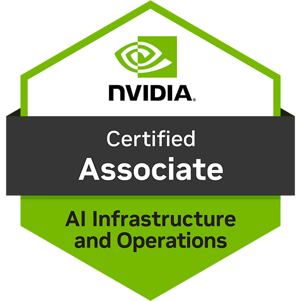

# Credential: AI Infrastructure & Operations Fundamentals

**Issuer:** NVIDIA / Credly  
**Holder:** Ishaan Shrivastava  
**Issue date:** `2026-05-24`  
**Verification:** [Credly public link](https://www.credly.com/badges/48cd3a80-fe99-438c-8924-2877e5fc6b8c/public_url)  

{width="270" height="270"}

## What it certifies

This credential verifies foundational knowledge of AI infrastructure and operations, including GPU compute, scale-up vs scale-out design, networking, containerized ML workloads, inference serving, monitoring, and operational tooling.

## Skills demonstrated

- AI infrastructure
- GPU systems
- Cluster operations
- NVIDIA NGC
- Containerized ML workloads
- Networking for AI clusters
- Monitoring with Prometheus and Grafana
- Triton Inference Server

## Machine-readable and LLM-friendly artifacts

- [JSON credential record](credentials.json)
- [Markdown credential record for LLMs](badges/nvidia-ai-infra-ops.md)
- [Credential PDF](NVIDIA-CertifiedAssociateAIInfrastructureandOperations202520260524-31-zatt1m.pdf)
