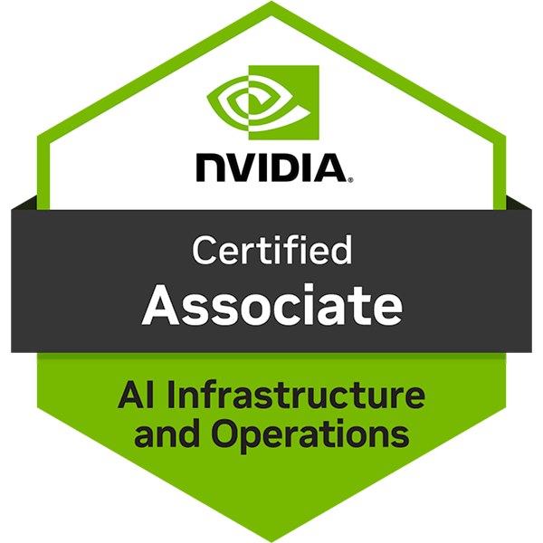

## Improving Deep Neural Networks: Hyperparameter Tuning, Regularization and Optimization

- **Issuer:** DeepLearning.AI / Coursera
- **Holder:** Ishaan Shrivastava
- **Issue date:** `2022-06-07`
- **Verification:** [Coursera certificate](https://www.coursera.org/account/accomplishments/certificate/9MGR26ERUA34)

This course credential covers practical techniques for improving deep neural networks, including hyperparameter tuning, regularization, optimization, and systematic error analysis.

## Future of AI

- **Issuer:** BlueDot Impact
- **Holder:** Ishaan Shrivastava
- **Issue date:** `2026-08-05`
- **Verification:** [BlueDot certificate](https://bluedot.org/certification?id=receymlVSPZQ63YoP)

This credential certifies completion of BlueDot Impact's Future of AI course, covering today's AI systems, possible paths toward AGI, and the societal implications of advanced AI.

## NVIDIA-Certified Associate: AI Infrastructure and Operations

- **Issuer:** NVIDIA / Credly
- **Holder:** Ishaan Shrivastava
- **Issue date:** `2026-05-24`
- **Verification:** [Credly public badge](https://www.credly.com/badges/48cd3a80-fe99-438c-8924-2877e5fc6b8c/public_url)

{fig-alt="NVIDIA-Certified Associate: AI Infrastructure and Operations badge"}

This credential verifies knowledge of the NVIDIA software stack, AI and deep-learning fundamentals, GPU and CPU architectures, AI infrastructure, cluster and job scheduling, and accelerated infrastructure virtualization.

### Credential artifacts

- [JSON credential record](credentials.json)
- [Markdown credential record for LLMs](badges/nvidia-ai-infra-ops.md)
- [Credential PDF](NVIDIA-CertifiedAssociateAIInfrastructureandOperations202520260524-31-zatt1m.pdf)
