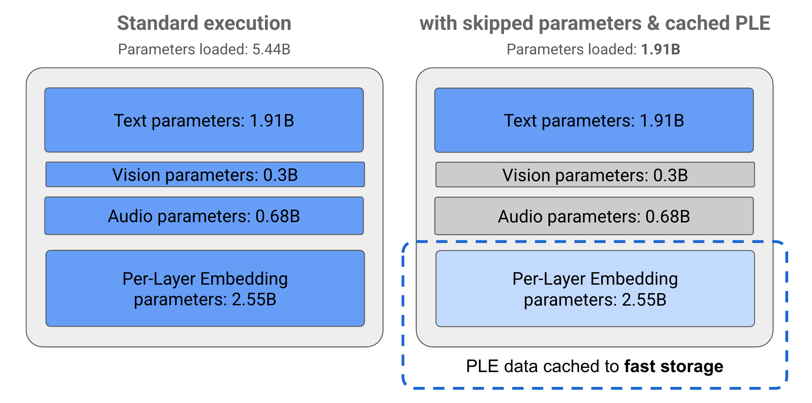
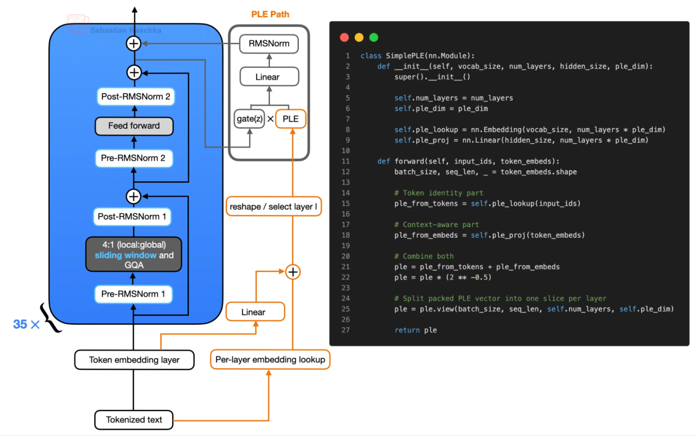
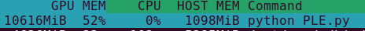
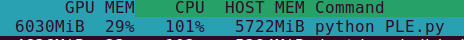
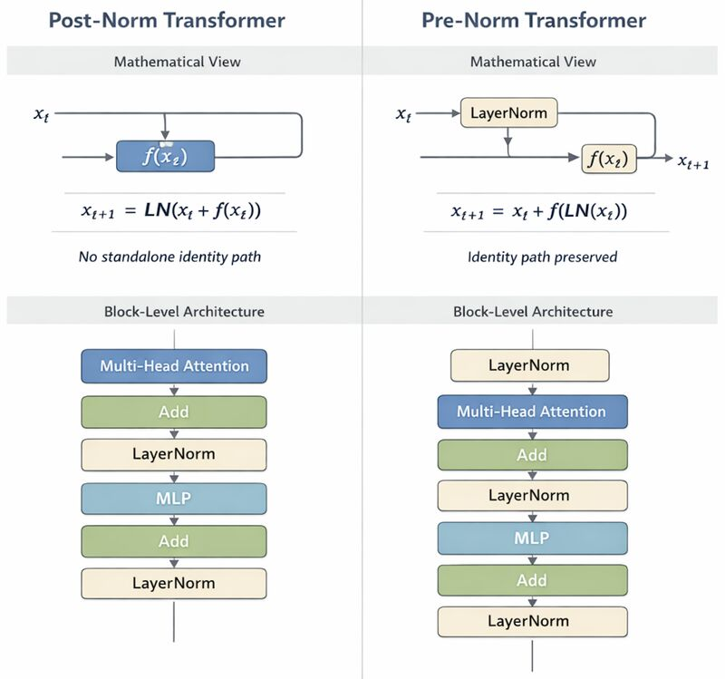
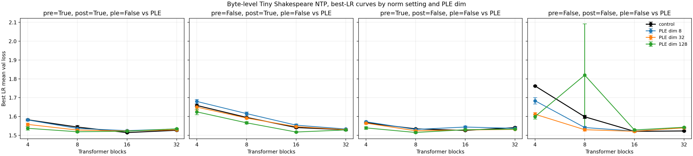

Does anyone have any idea of what Gemma-style Per-Layer-Embeddings actually do? Lets pull up **Gemma 4 E4B** for a closer look. 



Google itself doesn't offer much on this matter[^1], so let me explain. It's simple - you can offload the per-layer embeddings to the CPU without impacting throughput. Think of it like a form of sparsity, different in nature from Mixture of Experts (MoE), since we are improving the capabilities of a model by adding additional sets of embeddings at every single layer, instead of scaling the model width or depth. This allows us to store the entire lookup table on flash storage (a whopping 3.5B params out of 8B!) rather than needing valuable VRAM meant for storing the rest of the model parameters.

Let's do a [back-of-the-envelope calculation](https://en.wikipedia.org/wiki/Back-of-the-envelope_calculation) on the memory transferred between the CPU-offloaded embedding table in the case. The core idea here is to observe that the memory traffic for the embeddings being sent between devices is far less than the whole size of the PLE table.



$$\begin{aligned}\text{Total PLE bytes } = \text{ 262,144 vocabulary size * 35 N layers * 256 embed dim } = 2.35 * 10^9\text{  bytes}\end{aligned}$$

whereas

$$\text{Memory Traffic per token decoded} = \text{ 1 token indexed per layer per decode * 35 N layers * 256 embed dim } = 8.9 * 10^3\text{ bytes}$$

which is *6 orders of magnitude smaller* than the entire embedding table! Thus, we can index the embedding table on the CPU and then send the bytes over to the device for layerwise inference, and it doesn't end up becoming a inference bottleneck.

I couldn't find code to do this on the HuggingFace version of Gemma 3n, so I wrote my own little snippet to do this using pytorch hooks - [Full reproducible script annotated with comments here](https://gist.github.com/shrivastava95/6a6249c5d8cdb3d79376075a98678c63)

```
Gemma3nForConditionalGeneration.from_pretrained('google/gemma-3n-e2b-it', torch_dtype=torch.bfloat16,).to('cuda').eval()

lm = model.model.language_model
lm.embed_tokens_per_layer.to(device="cpu", dtype=torch.float16)

@torch.no_grad()
def get_per_layer_inputs_cpu(self, input_ids: torch.LongTensor) -> torch.Tensor:
    ids_cpu = input_ids.to("cpu", non_blocking=True)
    ple_cpu = self.embed_tokens_per_layer(ids_cpu)
    ple_cpu = ple_cpu.reshape(*ids_cpu.shape, self.config.num_hidden_layers, self.hidden_size_per_layer_input,)
    return ple_cpu.to(device=input_ids.device, dtype=torch.bfloat16, non_blocking=True)

lm.get_per_layer_inputs = types.MethodType(get_per_layer_inputs_cpu, lm)
del model.model.audio_tower, model.model.embed_audio
gc.collect()
torch.cuda.empty_cache()

generation = model.generate(**inputs, max_new_tokens=100, do_sample=False)
print(processor.decode(generation[0]), skip_special_tokens=True)

# **Overall Impression:** The image is a close-up shot of a vibrant garden scene,
# focusing on a cluster of pink cosmos flowers and a busy bumblebee.
# It has a slightly soft, natural feel, likely captured in daylight.
``` 

Here are the VRAM savings, the GPU usage visibly drops right after the hook is applied, seen through `nvtop`

Before CPU offload:


After CPU offload:


### PLE performance gains?

It is not immediately obvious *HOW* PLE improves performance. Why even bother? What problem do they solve at this model scale? All I've been able to find so far on this matter are sloppy medium posts and I don't trust them. I spent a good while trying to figure it out... honestly, I still don't know for sure, I think it would make for a great mech-interp paper. Let's try to work this out anyway! 



My rough understanding of transformers is that attention approximates computation and MLP approximates memory. Looking at the architecture diagram, we can see two things:

1. **Residual stream gating the PLE lookup** - A simple hypothesis I have is that the layer-wise lookup allows the model to store and recall a great deal of information as the lookup is precomputed for every forward pass, instead of going through matmuls in the MLP, thereby increasing capacity without commensurate increases in VRAM occupancy.

2. **Mix-LayerNorm (pre + post)** - The transformer blocks use post-norm as well as pre-norm. The disadvantage of Post-norm is that it keeps the L2 norm of the hidden state activations approximately constant across layers as there is no identity path, which means signals originating from early layers keep shrinking as they propagate forward, leading to vanishing influence on the output (and, correspondingly, vanishing gradients). This is a well known problem with post-norm, which is why most LLMs these days use pre-norm as it avoids training instability issues with increase in depth [reference - blog by Ziming Liu](https://kindxiaoming.github.io/blog/2026/depth-1/). Since gemma uses both, it might still suffer from the described post-norm limitation. I have a suspicion that if post-norm were not used in the Gemma architecture, these per-layer embeddings would correspondingly not also have been necessary (simply allow information from first layer token embeddings to flow through the residual stream and reach every layer normally).

## Implementing PLE - from scratch (it works!)

Out of curiosity, I cooked up a small-scale transformer baseline on the shakespeare corpus, modeled as NTP on raw byte pairs (yes, I didn't use a tokenizer, literally next-byte prediction). Here are some results:  



```
  - prenorm=False, postnorm=False
      - ple_dim=0: 1.601218
      - ple_dim=8: 1.571632
      - ple_dim=32: 1.550698
      - ple_dim=128: 1.622619

  - prenorm=False, postnorm=True
      - ple_dim=0: 1.581143
      - ple_dim=8: 1.595611
      - ple_dim=32: 1.579468
      - ple_dim=128: 1.559271

  - prenorm=True, postnorm=False
      - ple_dim=0: 1.541992
      - ple_dim=8: 1.546094
      - ple_dim=32: 1.537176
      - ple_dim=128: 1.529346

  - prenorm=True, postnorm=True
      - ple_dim=0: 1.541877
      - ple_dim=8: 1.544192
      - ple_dim=32: 1.534553
      - ple_dim=128: 1.528164

  Averaged across all four norm settings
  - ple_dim=0: 1.566558
  - ple_dim=8: 1.564382
  - ple_dim=32: 1.550474
  - ple_dim=128: 1.559850
```

Ignoring the weird error bars on the rightmost chart for x=8, we can see that the average performance over validation generally improves with increase in PLE dimension which tells us that PLE does indeed improve performance on this simple toy task. 


# footnotes
[^1]: Google generously spent the equivalent of a paragraph worth of tokens to explain Per-Layer-Embeddings in their [blog on Gemma 3n](https://ai.google.dev/gemma/docs/gemma-3n) last year. Recently, they one-upped themselves, offering a *single sentence* worth of information about PLE in the docs for their latest open-source model series, [Gemma 4 - link here](https://ai.google.dev/gemma/docs/core). In other words, they offer zero explanation about why it improves the performance over simply injecting the embeddings into the residual stream, or why they could not have simply kept a normal embedding table and just made it larger, and so on.
