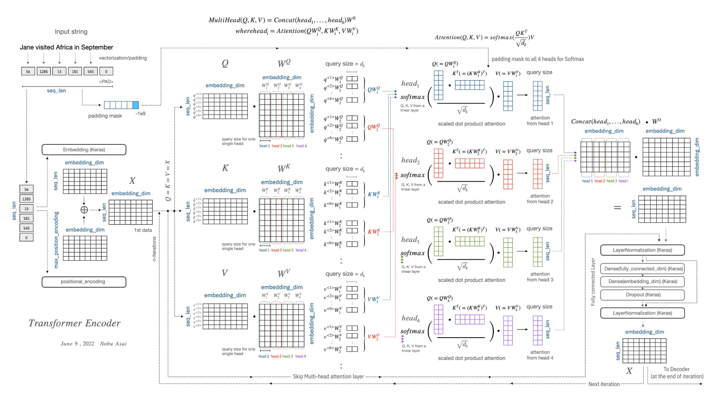

# How to understand transformer in one image?
- Here is a useful diagram explaining the transformer encoder in great detail. 

# What is a Transformer?
Transformers are a sequence modelling and transduction architecture heavily leveraging self-attention in order to eliminate the need for convolutions or gating. Advantages over RNNs and LSTMs include:

1. **Non recurrent computation** - Computation for a layer at a given depth is completely parallelized, while in prior architectures the computation at a given position and depth required computing for all the depths before them.
2. **Global dependency modelling** - Prior architectures featured a growth in computation required to relate information between positions with larger distance between them. Transformers do away with this limitation by modelling dependencies in a global fashion.
3. **Permutation invariance** - The transformer architecture fundamentally looks at its inputs as a <u>set of elements</u>[^1], as opposed to a sequence. This makes it incredibly powerful and widely applicable.

# Transformer Architecture
The transformer architecture features an encoder-decoder setup in the fashion of a typical neural machine translation task. The encoder maps a sequence of symbol representations $(x_1, ..., x_n)$ to a sequence of continuous representations $\bf{z}$$\space= (z_1, ..., z_n)$. Given $\bf{z}$, the decoder then generates the output sequence of symbols $(y_1, ..., y_m)$ in an auto-regressive fashion.

Let us introduce the building blocks of the transformer architecture.
### 1. Scaled dot-product attention
The output is calculated as a weighted sum of values of dimension $d_v$. The weights are softmaxed scores, and the scores are obtained by computing the dot-product of an input query with the key vector associated with that value, each being of dimension $d_k$.

$$\displaylines{q_{pos} = [...]_{1 \times d_k} \\
K = [...]_{n \times d_k} \\
V = [...]_{n \times d_v}}$$

... which yields the scaled dot-product attention formula:

$$o_{pos} = \text{softmax}\bigg(\dfrac{q_{pos} \cdot K^T}{\sqrt{d_k}}\bigg)\cdot V$$

... which, in practice, is further vectorized:

	$$O = \text{Attention}(Q, K, V) = \text{softmax}\bigg(\dfrac{Q\cdot K}{\sqrt{d_k}}\bigg)\cdot V$$
### 2. Multi-head attention
It is found that a single attention function with $d_{model}$ dimensional keys, queries and values can be improved upon. The input matrices $Q$ and $K$ are projected to $d_k$, and $V$ is projected to $d_v$, and this is done multiple times across $h$ different <u>heads</u>[^2]. The scaled dot-product attention outputs of each head are concatenated and finally projected once again.

$$\displaylines{
\text{MultiHeadAttention(Q, K, V) = Concat}(\text{head}_1, ..., \text{head}_h)\cdot W^O \\
\text{where head}_i = Attention(Q\cdot W^Q_i, K\cdot K^Q_i, V\cdot W^V_i)
}$$

### 3. Types of Attention
- The encoder uses multi-head **self-attention** layers. In self-attention, all of the keys, queries, and values come from the same place, i.e. the output of the previous encoder layer.
- The decoder uses two kinds of multi-head attention layers - **cross-attention** takes in keys and values from the encoder outputs, while the queries come from MHSA earlier within the same decoder block. This particular choice allows the decoder to relate the current position with representations from all positions of the encoder. 
- Additionally, the decoder uses **self-attention layers with masking** in order to allow each position in the decoder to attend to all positions up to and including that position. This is done to prevent leftward information flow in the decoder to preserve the auto-regressive property.[^3] 

### 4. Position-wise feed forward networks
Each encoder/decoder block applies a fully-connected feed-forward network on each position, identically and separately.

$$\text{FFN}(x_i) = \text{Linear}(\text{ReLU}(\text{Linear}(x_i)))$$

The dimensionality of input and output is $d_{model} = 512$, while that of the middle layer is $d_{f f} = 2048$

### 5. Positional encoding
Multi-head attention cannot keep track of temporal information unless explicitly given.[^1] In order for the model to make use of the order of the sequence, we must inject some information about the relative or absolute position of elements in the sequence. To achieve this, we add positional embeddings to the input embeddings. These embeddings carry the same dimension $d_{\text{model}}$ as the embeddings, allowing them to be summed.

$$\displaylines{
PE_{pos, 2i} = sin(pos/10000^{2i/d_\text{model}}) \\
PE_{pos, 2i+1} = cos(pos/10000^{2i/d_\text{model}}) 
}$$

### 6. Tokenizer
The tokenizer converts 

# Footnotes
[^1]: One crucial characteristic of the multi-head self-attention is that it is permutation-invariant with respect to its inputs. This means that if we switch between two inputs elements in the sequence, e.g. X1 <-> X2, the output is exactly the same besides the elements 1 and 2 switched. Read more [here.](https://uvadlc-notebooks.readthedocs.io/en/latest/tutorial_notebooks/tutorial6/Transformers_and_MHAttention.html#:~:text=One%20crucial%20characteristic%20of%20the,elements%201%20and%202%20switched.)
[^2]: Each head can be thought of as computing information from different representation subspaces, attending information from different positions. Using some inspiration from [Toy Models of Superposition](https://transformer-circuits.pub/2022/toy_model/index.html#phase-change), I opine that a head could be thought of as a coarse computation across different feature sets, which would benefit the availability of different heads.
[^3]: I suppose that information flows where the gradient goes? I do not completely understand the reasons motivating this choice.

